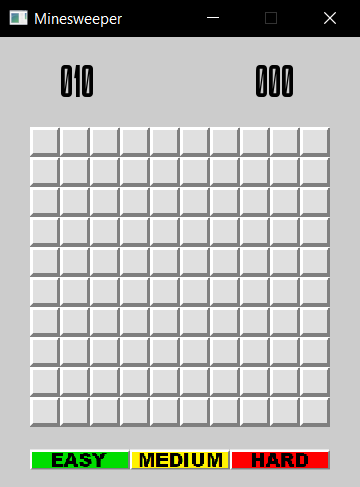
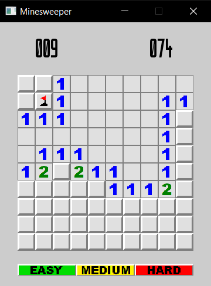
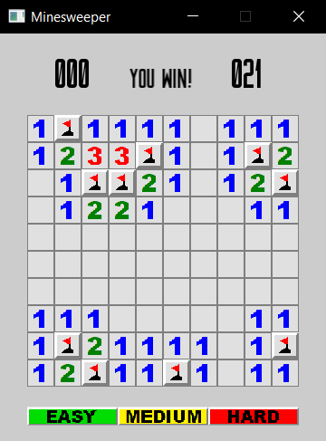

# Minesweeper

## How To Play
When the window opens, left click on any tile to begin the game.

 

Right click on a tile to set a flag. Right click it again to remove it.

Left clicking on a tile that is mined will result in a loss.

Reveal all unmined tiles to win.

To restart the game, click one of the difficulty buttons on the bottom of the window.