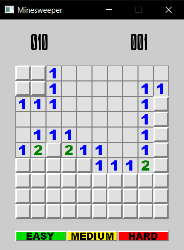
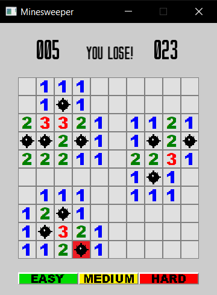

# Minesweeper

## How To Play
When the window opens, left click on any tile to begin the game.

 

Right click on a tile to set a flag. Right click on it again to remove the flag.

Left clicking on a tile that is mined will result in a loss.

Reveal all unmined tiles to win.

To restart the game, click on one of the difficulty buttons on the bottom of the window.
